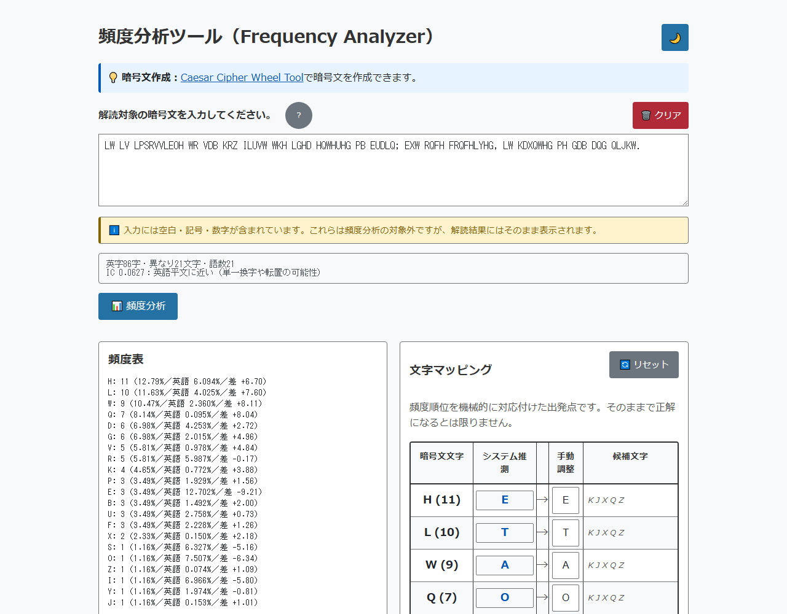
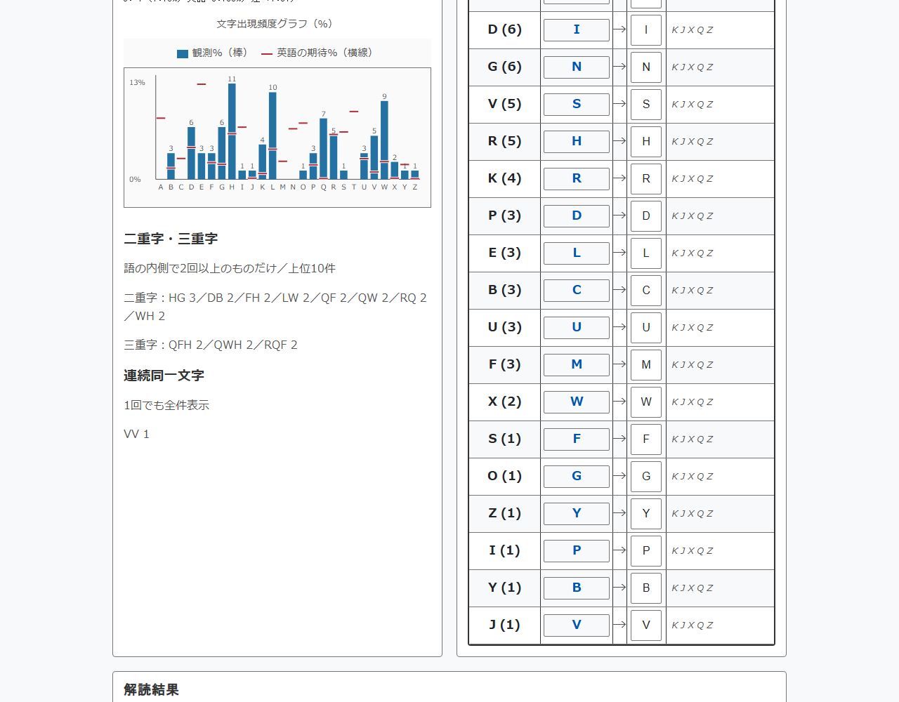
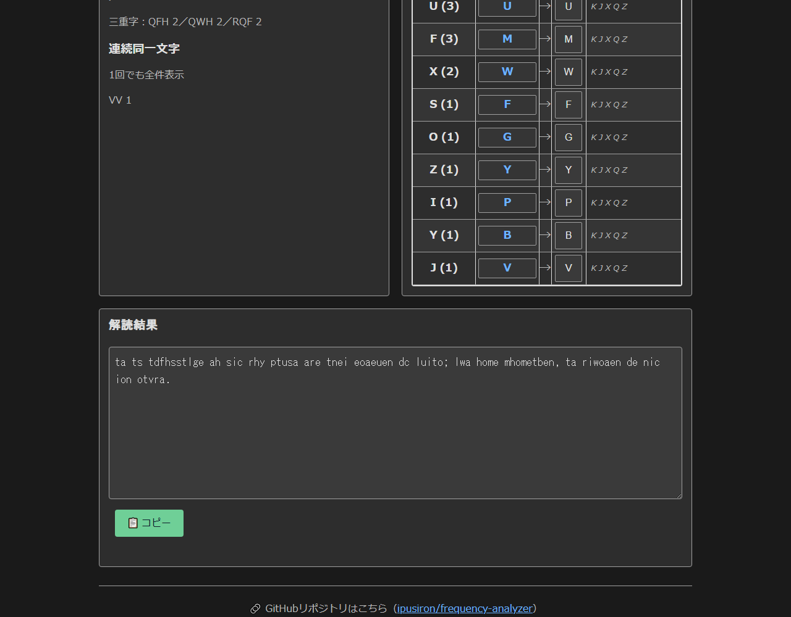
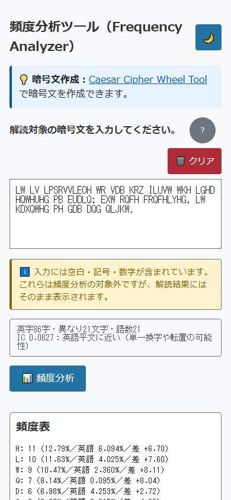

# Frequency Analyzer

English · [日本語](README.md)


[](https://ipusiron.github.io/frequency-analyzer/)

**Day009 - Security Tools 100 with Generative AI**

Frequency Analyzer is a frequency analysis and manual decryption workbench for English ciphertext.
It brings together standard English letter frequencies, the index of coincidence (IC) and n-gram counts
so that you can break a monoalphabetic substitution cipher by hand.

---

## 🌐 Demo

👉 [https://ipusiron.github.io/frequency-analyzer/](https://ipusiron.github.io/frequency-analyzer/)

---

## 📸 Screenshots

<p align="center"></p>

> *86 letters and IC 0.0627 for the sample ciphertext, with the frequency list*

<p align="center"></p>

> *Bars for the observed %, rules for the expected English %, plus bigrams and trigrams*

<p align="center"></p>

> *The mapping table with candidate letters, and the decrypted text*

<p align="center"></p>

> *Single-column layout at 390px wide*

---

## ✨ Features

- **Letter counts with a comparison chart**
- **Automatic mapping from the ETAOIN order**
- **Manual mapping with conflict detection**
- **Live preview of the decrypted text**
- **Candidate letters, chosen from the letters still unused**
- **Copy and clear buttons**
- Comparison against standard English frequencies, the index of coincidence, and bigrams,
  trigrams and doubled letters counted inside words
- Manual edits survive re-analysis; light and dark themes; mobile layout
- Japanese and English interface (header button, `?lang=ja` / `?lang=en`, remembered between visits)

---

## 📖 How to use

1. Open the page and read the analysis of the sample ciphertext, which runs automatically.
2. Look through the frequency list, the chart, the IC and the n-grams.
3. Take the automatic guess as a starting point and edit letters in the mapping column.
4. Press **📊 Analyze** to analyze again. Letters you edited by hand keep their values.
5. Press **📋 Copy** to copy the decrypted text. Where the clipboard API is unavailable,
   the text is selected for you so that you can copy it by hand.
6. Press **🔄 Reset** to drop your manual edits and return to the automatic guess.
7. Press **🗑️ Clear** to empty the input and every panel.
8. Press the **日本語** / **English** button in the header to switch languages. Nothing is lost:
   the statistics, chart, n-grams, candidates and notices are all re-rendered in the other language.

---

### 🔐 About the input

- Only uppercase A–Z are counted.
- Lowercase letters are treated as plaintext you have already confirmed, and pass through unchanged.
- Letters typed in lowercase are removed from the automatic guess and from the candidate lists.
- The IC and the n-grams also count uppercase only; lowercase letters act as word boundaries.
- Spaces, punctuation, newlines and non-Latin characters are accepted and printed unchanged.

For example, `ABcDE` counts as 4 letters in 2 words, and its bigrams are `AB` and `DE` only.
The confirmed plaintext `c` is never removed to make a bigram `BD`.

#### Mixing case while you work

You can feed in a ciphertext that is already partly solved.

```
THe QUICk BRoWN foX JUMPs oVeR THe LAZy DoG
```

Here only the uppercase letters are counted.
The lowercase `e, k, o, f, s, y` are printed as they are and left out of the candidates.

---

### 🔗 Loading a ciphertext from the URL

A GET parameter loads a ciphertext when the page opens.

#### How to build the URL

Append `#text=` (recommended) or `?text=` and a URL-encoded ciphertext. The part after `#` is not sent to the server, so the ciphertext does not reach GitHub Pages and is not subject to the URL length limit (GitHub Pages accepts up to 8,192 bytes for the path and the part after `?`).

```
https://ipusiron.github.io/frequency-analyzer/#text=LW%20LV%20LPSRVVLEOH
https://ipusiron.github.io/frequency-analyzer/?text=LW%20LV%20LPSRVVLEOH
```

#### Details of the parameter

- **Name**: `text`
- **Format**: a URL-encoded string
- **Limit**: 5,000 characters
- **Behavior**: the value fills the input box on load, and the analysis runs at once.
- **Where**: the part after `#` is read first; otherwise the part after `?`.
- **After reading**: `text` is removed from both `#` and `?` in the URL (so it does not stay in the address bar, bookmarks or copied URLs). The URL as opened may remain in the browser history.

The value is decoded exactly once, by `URLSearchParams`.
So `?text=100%25` gives `100%` and `?text=%2541BC` gives `%41BC`; there is no second decoding pass.
`?text=A%2BB` gives `A+B`, and `?text=A+B` gives `A B`.
Exactly 5,000 characters is accepted; anything longer is rejected with a warning on the page.

---

## 📐 What the screen shows

- Statistics: letters, distinct letters, words, the IC and its verdict, and a note for short texts
- Frequency list and chart: count, observed %, expected English % and the difference,
  drawn as bars against rules for the expected values
- N-grams: bigrams and trigrams inside words, 2 or more occurrences, top 10;
  doubled letters are listed in full, even a single occurrence
- Mapping table: the automatic guess, your manual value, and up to 8 candidates plus a remainder count
- Decrypted text: lowercase substitutions, a highlight on change, and a copy notice
- Language: the header button switches between Japanese and English

Candidates exclude letters already used, letters confirmed as plaintext, and the current value of that row.
In the initial state every row offers `K J X Q Z`; clearing the manual value of `H` gives `E K J X Q Z`.
A duplicated plaintext letter is reported by the message list and by `aria-invalid`, not by color alone.

## 🎯 Use cases

### Ways of using this tool in particular

- Telling romanized Japanese from English (language and cryptography classes, Japanese puzzles): the Iroha poem in romaji (91 letters) has 47 vowels, or 51.6%, while the opening of the Gettysburg Address (143 letters) has 40.6% (38.1% in the standard English frequency table). The index of coincidence (IC), on the other hand, is 0.066 for the Iroha poem and 0.068 for the address, and both are judged "plaintext-like". IC alone cannot tell the languages apart, but the share of vowels can
- Comparing keyboard layouts by letter frequency: counted with the standard English frequency table, letters typed on the top row of a QWERTY keyboard make up 51.3%, the home row 34.0% and the bottom row 14.6%. It gives numbers for discussing layout design, that is, which row the common letters should go on
- Planning the first move in a word game: use the order of English letter frequency (E, T, A, O, I, N, S, H, R, ...) when choosing the first word in a word-guessing game such as Wordle (the frequencies of running text and of five-letter words are not the same, so treat it as a guide)

### 🧠 As an aid to cryptanalysis

Frequency analysis helps against ciphers such as these.

- **Caesar cipher**
- **Monoalphabetic substitution**
- **Vigenère cipher, once the ciphertext has been split into columns**

---

### Working through a Vigenère cipher

The steps below are condensed from pages 71–75 of
[*Security Tools 100 with Generative AI*](https://akademeia.info/?page_id=44531) (in Japanese).

1. First decide which family the target ciphertext belongs to. The index of coincidence is the useful
   statistic here: it is the probability that two letters drawn at random from the text are the same.
   In classical cryptanalysis it is used above all to estimate a key length.

- [IC Learning Visualizer](https://github.com/ipusiron/ic-learning-visualizer) - visualize the index of coincidence (Day047)
- [Cipher Clairvoyance](https://github.com/ipusiron/cipher-clairvoyance) - guess the cipher family (Day044)

2. Once the text looks like a Vigenère cipher, estimate the key length. The Kasiski examination works
   well, and inside this project the following tool is the right one.

- [RepeatSeq Analyzer](https://github.com/ipusiron/repeatseq-analyzer) - find repeated strings (Day028)

3. With a key length in hand, split the ciphertext into that many columns. For a key length of 5,
   the split can be done on the command line like this.

```bash
$ cat cipher.txt | fold -w1 | awk 'NR%5==1' > col1.txt
$ cat cipher.txt | fold -w1 | awk 'NR%5==2' > col2.txt
$ cat cipher.txt | fold -w1 | awk 'NR%5==3' > col3.txt
$ cat cipher.txt | fold -w1 | awk 'NR%5==4' > col4.txt
$ cat cipher.txt | fold -w1 | awk 'NR%5==0' > col5.txt
```

The commands are there to show the mechanism. In practice, Modular Text Divider does the same split in
the browser, and each column comes with a button that opens Frequency Analyzer with the text already
filled in.

- [Modular Text Divider](https://github.com/ipusiron/modular-text-divider) - split text into columns (Day030)

4. Analyze each column here. Frequency Analyzer lines up the observed order with the ETAOIN order and
   proposes a plaintext letter for every ciphertext letter.

At this stage the goal is not to name the cipher but to recover the key. It is enough to find the
ciphertext letter that stands for plaintext `E`. Look at the chart: a single bar far above the rest is
very likely `E`. When several letters are equally tall, any one of them may be `E`.

Suppose the columns give these readings.

- Column 1: plaintext `E` ⇔ ciphertext `I`, `X` or `S`
- Column 2: plaintext `E` ⇔ ciphertext `E` or `T`
- Column 3: plaintext `E` ⇔ ciphertext `K`
- Column 4: plaintext `E` ⇔ ciphertext `P` or `E`
- Column 5: plaintext `E` ⇔ ciphertext `X` or `I`

5. Read the key letters off the Vigenère square. This part is pure arithmetic, and the Tabula Recta tab
   of [Vigenere Cipher Tool (Day017)](https://github.com/ipusiron/vigenere-cipher-tool) does it for you.

The candidates per column come out as follows.

- Column 1: E, T, O
- Column 2: A, P
- Column 3: G
- Column 4: L, A
- Column 5: T, E

6. Combine the candidates to recover the key. Generating every combination is enough to guarantee that
   one of them is correct; when there are too many, the background of whoever wrote the message
   (origin, native language, period, temperament) narrows the field. If the key is likely to be a word,
   filtering the combinations against a word list finds it quickly.

- [AlphaLoom](https://github.com/ipusiron/alphaloom) - combine letters and analyze the strings produced (Day046)

For the example above, AlphaLoom yields the key `EAGLE`.

7. Confirm the key by decrypting. Vigenere Cipher Tool does that in one step. If the output reads as
   natural English, the key is right; with several candidates, only one of them will produce English.

---

## 🔬 How it works

### Comparison with standard English frequencies

The observed % is the count of a ciphertext letter divided by the total number of letters.
The expected % is the standard English frequency of the *same* letter of the alphabet — it is not the
probability of the plaintext letter behind it. The difference is the observed % minus the expected %.
The frequency table comes from Figure 1.6 of *Wireless Communications Systems: An Introduction* by
Randy L. Haupt ([excerpt published by Wiley, page 6](https://catalogimages.wiley.com/images/db/pdf/9781119419174.excerpt.pdf)).
Real frequencies vary with the kind of text.

| Letter | Standard English frequency (%) |
|---|---:|
| A | 8.167 |
| B | 1.492 |
| C | 2.782 |
| D | 4.253 |
| E | 12.702 |
| F | 2.228 |
| G | 2.015 |
| H | 6.094 |
| I | 6.966 |
| J | 0.153 |
| K | 0.772 |
| L | 4.025 |
| M | 2.406 |
| N | 6.749 |
| O | 7.507 |
| P | 1.929 |
| Q | 0.095 |
| R | 5.987 |
| S | 6.327 |
| T | 9.056 |
| U | 2.758 |
| V | 0.978 |
| W | 2.360 |
| X | 0.150 |
| Y | 1.974 |
| Z | 0.074 |

### Measured values for the sample ciphertext

| Item | Value |
|---|---:|
| Letters | 86 |
| Distinct letters | 21 |
| Total characters | 109 |
| Words | 21 |
| IC (4 decimal places) | 0.0627 |
| Correct ETAOIN guesses | 2/21 |

| Ciphertext letter | Count | Observed % | Expected English % | Diff |
|---|---:|---:|---:|---:|
| H | 11 | 12.79 | 6.094 | +6.70 |
| L | 10 | 11.63 | 4.025 | +7.60 |
| W | 9 | 10.47 | 2.360 | +8.11 |
| Q | 7 | 8.14 | 0.095 | +8.04 |
| D | 6 | 6.98 | 4.253 | +2.72 |
| G | 6 | 6.98 | 2.015 | +4.96 |

The sample ciphertext is this.

```text
LW LV LPSRVVLEOH WR VDB KRZ ILUVW WKH LGHD HQWHUHG PB EUDLQ; EXW RQFH FRQFHLYHG, LW KDXQWHG PH GDB DQG QLJKW.
```

Shifting every letter three places back through the alphabet gives the plaintext.

```text
it is impossible to say how first the idea entered my brain; but once conceived, it haunted me day and night.
```

### The index of coincidence, and its limits

The index of coincidence is `IC = Σ f_c(f_c − 1) / (n(n − 1))`, where `f_c` is the count of letter `c`
and `n` is the number of letters. Fewer than 2 letters gives no value at all.
English plaintext sits around 0.0667; a flat distribution over 26 letters is about 0.0385.
Substitution and transposition both preserve the letter counts, so the IC alone cannot tell them apart.

| IC range | Verdict shown on screen |
|---|---|
| 0.060 and above | Close to English plaintext (monoalphabetic substitution or transposition) |
| 0.045 to below 0.060 | Inconclusive |
| below 0.045 | Close to a flat distribution (polyalphabetic cipher) |

Dropping the spaces and punctuation from the sample and keeping the first *n* letters gives these values.

| Letters | IC (6 decimal places) |
|---|---:|
| 10 | 0.133333 |
| 20 | 0.073684 |
| 50 | 0.059592 |
| 86 | 0.062654 |

Short texts move a long way, so a note appears below 30 letters.
The threshold of 30 is a deliberately generous design choice, not a proven lower bound.
Encrypting the same plaintext with the Vigenère key `EAGLE` drops the IC to 0.044049
(the key advances on letters only).

### N-grams and manual editing

Bigrams and trigrams are counted inside words only. Strings that straddle a word boundary would be
indistinguishable from real spelling patterns, which is exactly the clue we are after.
The sample has 56 distinct bigrams over 65 occurrences; those appearing twice or more are
`HG 3 / DB 2 / FH 2 / LW 2 / QF 2 / QW 2 / RQ 2 / WH 2`.
It has 41 distinct trigrams over 44 occurrences, with `QFH 2 / QWH 2 / RQF 2` appearing twice,
and the only doubled letter is `VV 1`.

A plain rank-for-rank ETAOIN mapping gets 2 of the 21 letters right (H→E and V→S).
That is the point of the tool: the automatic guess is a starting position, and you improve it with
n-grams, doubled letters and word shapes.
Re-analysis keeps your manual values and drops only the letters that have left the input.
Letters you never touched are renumbered from the new frequency order.

## 🔒 Security

Your text is never sent anywhere. The app makes no network requests, and the JavaScript and CSS it
needs are served from the same origin.
Neither the input nor the mapping is stored; only the light/dark choice and the interface language go
into `localStorage`.
If you put a ciphertext in the URL, it may survive in the address bar, the browser history and the
access log of whatever server delivered the page.

The CSP is declared in a `meta` tag and blocks external scripts, inline scripts and styles, objects and
form submissions. The page builds its DOM with `textContent`, and the referrer policy is `no-referrer`.
GitHub Pages cannot set arbitrary response headers, and `frame-ancestors` has no effect in a `meta` tag,
so it is not declared. This deployment therefore has no clickjacking defense from `frame-ancestors`
([CSP specification](https://www.w3.org/TR/CSP3/#directive-frame-ancestors)).

## ⚠️ Notes

- Neither the IC nor a frequency ranking can settle a cipher family or prove a solution.
- Lowercase letters are confirmed plaintext; never mix them into the ciphertext counts.
- Do not put confidential text into a URL parameter.
- Use this on ciphertext you are entitled to analyze, or on material meant for study.

## 🧪 Tests

Run `npm test` on Node 22 or newer. It uses `node --test`, with no npm dependencies.
GitHub Actions runs the suite on every push and pull request.
The tests cover the frequency counts, the IC, n-grams, candidates, retention of manual values,
decryption, URL handling, the HTML, color contrast, formatting, and the Japanese/English dictionaries.
The numbers in the README tables, the worked example and every image reference are recomputed from the
real code, so a stale document fails the build.

## ❓ FAQ

### The automatic guess is wrong

ETAOIN only lines up ranks, and ranks move with the length and the subject of the text.
Work from the candidates and the n-grams and edit by hand.

### Analyze, Reset and Clear

Analyze keeps the letters you edited by hand. Reset forgets those edits and returns to the automatic
guess. Clear empties the input and every panel.

## 🔗 See also

### Related tools

- **[Substitution Mapping Mixer](https://github.com/ipusiron/substitution-mapping-mixer) – a manual workbench for substitution ciphers** (Day105)
  - Useful when you want to try many mapping variants.

---

## 📁 Directory layout

```text
frequency-analyzer/
├── index.html          # input, statistics, chart and mapping
├── i18n.js             # Japanese and English dictionaries, and the switch
├── freq-logic.js       # analysis and decryption, with no DOM access
├── main.js             # DOM updates and event handling
├── style.css           # responsive layout and both themes
├── assets/             # four screenshots and an existing slide image
├── test/               # seven node:test files, including test/i18n.test.js
├── .github/workflows/test.yml # tests on push and pull request
├── package.json        # npm test (no dependencies)
├── CLAUDE.md           # development guide
├── LICENSE             # MIT License
├── README.en.md        # this file
└── README.md           # the Japanese README
```

## 💻 Requirements

Any modern browser: Chrome, Edge, Firefox or Safari.
Opening `index.html` over `file://` gives you every feature, because nothing is fetched over the network.
Where the clipboard API is missing, the page explains how to copy by hand.
To serve it over HTTP, `python -m http.server 8000` is enough.
Node 22 or newer is needed only to run the tests.

## 📄 License

This project is released under the [MIT License](./LICENSE).

---

## 🛠 About this tool

This tool was built as part of *Security Tools 100 with Generative AI*, a project that produces and
publishes one security-related tool a day for 100 days, with help from generative AI.

For the project and the other tools, see the following page (in Japanese).

🔗 [https://akademeia.info/?page_id=42163](https://akademeia.info/?page_id=42163)
