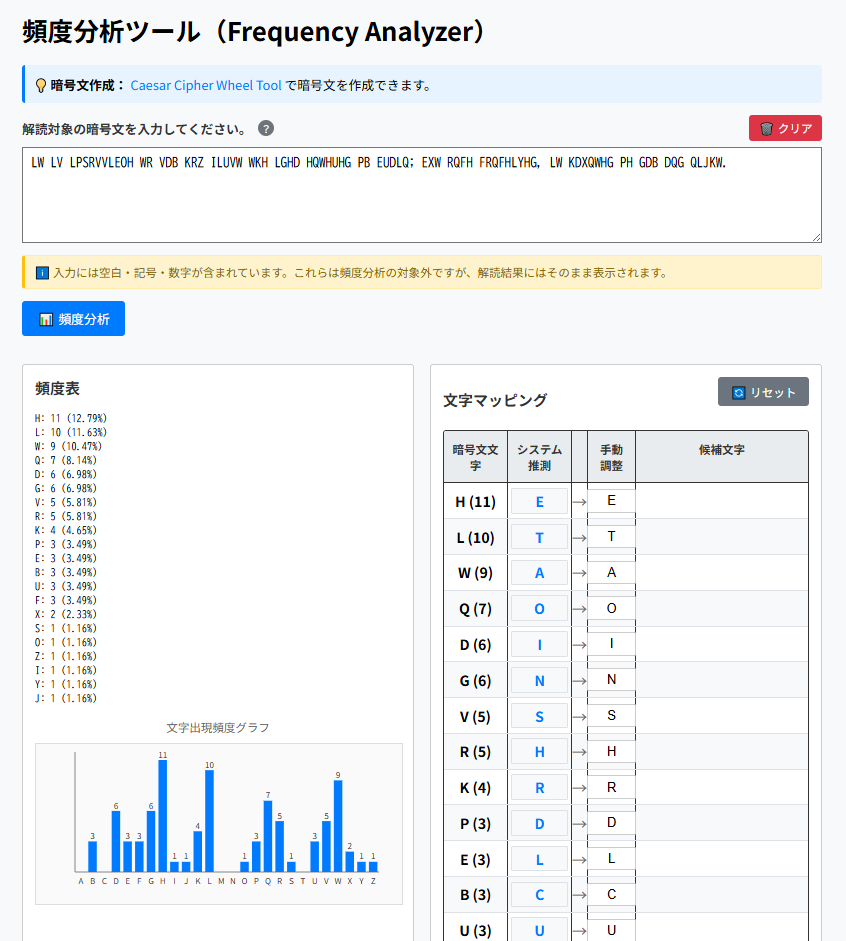

<!--
---
id: day009
slug: frequency-analyzer

title: "Frequency Analyzer"

subtitle_ja: "頻度分析ツール"
subtitle_en: "Frequency Analysis Tool for Classical Cipher Decryption"

description_ja: "英文ベースの暗号文を対象とした頻度分析＆解読ツール。単一換字式暗号の解読に役立ちます。"
description_en: "A frequency analysis and decryption tool for English-based ciphertext. Useful for breaking monoalphabetic substitution ciphers."

category_ja:
  - 暗号解析
  - 古典暗号
category_en:
  - Cryptanalysis
  - Classical Cryptography

difficulty: 3

tags:
  - frequency-analysis
  - cryptanalysis
  - monoalphabetic-substitution-ciphers

repo_url: "https://github.com/ipusiron/frequency-analyzer"
demo_url: "https://ipusiron.github.io/frequency-analyzer/"

hub: true
---
-->

# Frequency Analyzer - 頻度分析ツール

**Day009 - 生成AIで作るセキュリティツール100**

Frequency Analyzerは、英文ベースの暗号文を対象とした頻度分析＆解読ツールです。  
単一換字式暗号の解読に役立ちます。

---

## 🌐 デモページ

👉 [https://ipusiron.github.io/frequency-analyzer/](https://ipusiron.github.io/frequency-analyzer/)

---

## 📸 スクリーンショット

以下は実際の画面例です。

>
>
> *初期画面*

---

## 🔍 概要

本ツールは以下の処理を自動で行います：

- **文字ごとの出現頻度集計とグラフ表示**
- **ETAOIN順による自動マッピング推定**
- **マッピングの手動調整（競合検知あり）**
- **仮想復号結果の表示**
- **候補文字の提示（未使用文字から選出）**
- **結果のコピー・クリア機能**

---

## ✏️ 使い方

1. ページを開くと、デフォルトの暗号文が入力された状態で自動的に頻度分析が行われます。
2. 出現頻度が一覧とグラフで表示されます。
3. 推定されたマッピングが初期設定されており、そのままでも仮想復号が表示されます。
4. 必要に応じてマッピング欄で手動修正も可能です（重複検出機能あり）。
5. 「📋 コピー」で解読結果をコピーできます。
6. 「🔄 リセット」でマッピングを自動推定に戻します。
7. 「🗑️ クリア」で暗号文・表示結果をすべて初期化します。

---

## 🔐 入力について

- 入力できる文字は英語（A–Z、a–z）で、**空白・記号・改行も含んでOK**です。
- **大文字**は暗号文文字として扱われ、頻度分析の対象になります。
- **小文字**は確定済みの平文文字として扱われ、そのまま出力されます。
- 小文字で入力した文字は、システム推測の候補から自動的に除外されます。

### 大文字・小文字の使い分け例

部分的に解読が進んでいる暗号文を入力する場合：

```
THe QUICk BRoWN foX JUMPs oVeR THe LAZy DoG
```

この例では：
- 大文字（T, H, Q, U, I, C, K, B, R, W, N, F, X, J, M, P, S, V, L, A, Z, D, G）→ 暗号文文字として頻度分析
- 小文字（e, o）→ 確定済み平文としてそのまま出力、システム推測候補から除外

---

## 🔗 URL経由での暗号文読み込み

GETパラメーターを使用して、URL経由で暗号文を自動的に読み込めます。

### 使い方

URLに`?text=`パラメーターを付けて、URLエンコードした暗号文を渡します。

```
https://ipusiron.github.io/frequency-analyzer/?text=LW%20LV%20LPSRVVLEOH
```

### 仕様

- **パラメーター名**: `text`
- **形式**: URLエンコードされた文字列
- **文字数制限**: 5,000文字まで
- **動作**: ページ読み込み時に自動的に入力欄にセットされ、頻度分析が実行されます

---

## 🧠 解読補助としての用途

頻度分析は以下のような暗号解読に使われます：

- **シーザー暗号（Caesar Cipher）**
- **単一換字式暗号（Monoalphabetic Substitution）**
- **ヴィジュネル暗号の列分割後の分析**

---

## 🧪 ヴィジュネル暗号の解読補助として使うには？

### ゲーム「Cypher」でFrequency Analyzerを利用する

- [MONOALPHABETIC SUBSTITUTION PUZZLE 01【Cypher編】](https://akademeia.info/?p=35916)
- [MONOALPHABETIC SUBSTITUTION PUZZLE 02【Cypher編】](https://akademeia.info/?p=36034)
- [MONOALPHABETIC SUBSTITUTION PUZZLE 03【Cypher編】 ](https://akademeia.info/?p=36107)

### スライド「古典暗号のビジュアル解読法　ー生成AIツールで挑む暗号文の謎解きー」

「ゆるいハッキング大会 第122回」で発表した「古典暗号のビジュアル解読法」では、ヴィジュネル暗号文を自作ツールを使って解読しました。
その発表に使ったスライドが理解に役立つはずです。

- [ゆるいハッキング大会で「古典暗号のビジュアル解読法」を発表してきました](https://akademeia.info/?p=43255)
- [古典暗号のビジュアル解読法　ー生成AIツールで挑む暗号文の謎解きー](https://www.docswell.com/s/ipusiron/Z37Y8D-2025-08-23-155721)

<a href="https://www.docswell.com/s/ipusiron/Z37Y8D-2025-08-23-155721">
  
</a>

---

### 『生成AIで作るセキュリティツール100』で紹介したヴィジュネル暗号文の解読

ここに記載の内容は[『生成AIで作るセキュリティツール100』](https://akademeia.info/?page_id=44531)のP.71-75の内容を抜粋したものになります。

1. まず、ターゲット暗号文（解読対象の暗号文）がどの暗号方式によるものかを特定します。その際に有効なのが、一致指数（IC）という概念です。

一致指数とは、テキスト中から任意の2文字をランダムに選んだとき、それらが同じ文字である確率を表す指標です。
古典暗号の解読において、鍵長の推定などに利用される統計量です。

- [IC Learning Visualizer](https://github.com/ipusiron/ic-learning-visualizer) - 一致指数をビジュアル理解するツール（Day047）
- [Cipher Clairvoyance](https://github.com/ipusiron/cipher-clairvoyance) - 暗号化方式推定ツール（Day044）

2. ターゲット暗号文がヴィジュネル暗号文であると推測されたら、次に鍵長（鍵文字列の文字数）を推定します。

鍵長を求める手法としては、カシスキー法が有効です。
本プロジェクトのツールの中では、以下を用いるのが最適です。

- [RepeatSeq Analyzer](https://github.com/ipusiron/repeatseq-analyzer) - 反復文字列の特定ツール（Day028）

3. 鍵長を推定したら、ターゲット暗号文を列ごとに分割します。

たとえば、推定した鍵長が5の場合、暗号文を5つの列に分けることになります。
これをLinuxコマンドで実現するには、次のように入力します。

```bash
$ cat cipher.txt | fold -w1 | awk 'NR%5==1' > col1.txt
$ cat cipher.txt | fold -w1 | awk 'NR%5==2' > col2.txt
$ cat cipher.txt | fold -w1 | awk 'NR%5==3' > col3.txt
$ cat cipher.txt | fold -w1 | awk 'NR%5==4' > col4.txt
$ cat cipher.txt | fold -w1 | awk 'NR%5==0' > col5.txt
```

以上は列分割の仕組みを理解してもらうために、あえてLinuxコマンドを例に挙げて説明しました。

しかし、本プロジェクトで開発したModular Text Dividerを使えば、ブラウザー上の操作だけで簡単に列分割を実行できます。

- [Modular Text Divider](https://github.com/ipusiron/modular-text-divider) - テキスト列分割ツール（Day030）

また、列分割後の各テキストには「頻度分析」ボタンが用意されています。
このボタンを押すと、Frequency Analyzerに自動的に遷移し、分割されたテキストが入力欄にセットされます。
そのためすぐに頻度分析の工程に移れます。

4. 列分割テキストを頻度分析します。

Frequency Analyzerは「暗号文の出現頻度」と「英文の文字頻度」（ETAOIN順）を対応付けることで、暗号文文字と平文文字の候補を自動マッピングしてくれます。

ここで目的とするのは、暗号方式の特定ではなく、鍵文字列の推定です。
つまり、平文文字'E'に対応する暗号文文字を特定できればよいのです。
文字出現頻度のグラフを観察し、1つだけ飛び抜けて出現回数が多い文字があれば、その文字が平文文字'E'に対応する可能性が高いと考えられます。
また、複数の文字が同程度に多い場合は、それらのいずれかが'E'に対応している可能性があります。

ここでは、以下の結果が得られたと仮定します。

- 1列目：「平文文字’E’」⇔「暗号文文字'I' or 'X' or 'S'」
- 2列目：「平文文字’E’」⇔「暗号文文字'E' or 'T'」
- 3列目：「平文文字’E’」⇔「暗号文文字'K'」
- 4列目：「平文文字’E’」⇔「暗号文文字'P' or 'E'」
- 5列目：「平文文字’E’」⇔「暗号文文字'X' or 'I'」

5. ヴィジュネル暗号表を用いて、平文文字と暗号文文字から鍵文字を特定します。

このステップは、機械的な計算で実行できます。
前述のVigenere Cipher Toolの「タブラレクタ研究」タブには、「平文文字と暗号文文字から鍵文字を求める」機能が備わっています。
先に示した平文文字と暗号文文字の対応を入力すれば、鍵文字を算出できます。

以下は、各列の鍵文字候補になります。

- 1列目：E, T, O
- 2列目：A, P
- 3列目：G
- 4列目：L, A
- 5列目：T, E

6. 鍵文字候補を組み合わせて、元の鍵文字列を特定します。

鍵文字のすべての組み合わせパターンを生成すれば、その中の1つが正しい鍵文字列になります。
ただし、候補が多すぎる場合は、暗号文を作成した人物の特性（出身地、母国語、時代背景、性格など）を考慮すると効果的です。

もし鍵文字列に英単語が含まれている可能性があれば、生成パターンの中から英単語に一致するものを抽出することで、正しい鍵文字列を見つけやすくなります。
本プロジェクトでは、この処理を支援するツールも作成しました。

- [AlphaLoom](https://github.com/ipusiron/alphaloom) - 文字組み合わせ＆生成文字列分析ツール（Day046）

先の例でAlphaLoomを使うと、"EAGLE"という鍵文字列が導かれます。

7. 得られた鍵文字列が正しいかどうかは、実際に復号して確認します。

ヴィジュネル暗号の復号は、Vigenere Cipher Toolを使えば簡単に実行できます。
復号の結果、英文として自然に読めるのであれば、その鍵文字列が正しいことになります。
複数の候補が存在する場合でも、復号結果を比較すれば、英文として成立するものがただ1つに絞り込まれるはずです。

以上が、ヴィジュネル暗号文の解読に至るまでの一連の流れです。

---

## 🔗 関連ツール

- **[Substitution Mapping Mixer](https://github.com/ipusiron/substitution-mapping-mixer) – 換字式暗号の手動解析ワークベンチ**（Day105）
  - 置換表を試行錯誤で調整するときに役立つ。

---

## 📄 ライセンス

MIT License - 詳細は[LICENSE](LICENSE)をご覧ください。

---

## 🔥 このツールについて

本ツールは、「生成AIで作るセキュリティツール100」プロジェクトの一環として開発されました。 このプロジェクトでは、AIの支援を活用しながら、セキュリティに関連するさまざまなツールを100日間にわたり制作・公開していく取り組みを行っています。

プロジェクトの詳細や他のツールについては、以下のページをご覧ください。

🔗 [https://akademeia.info/?page_id=42163](https://akademeia.info/?page_id=42163)
