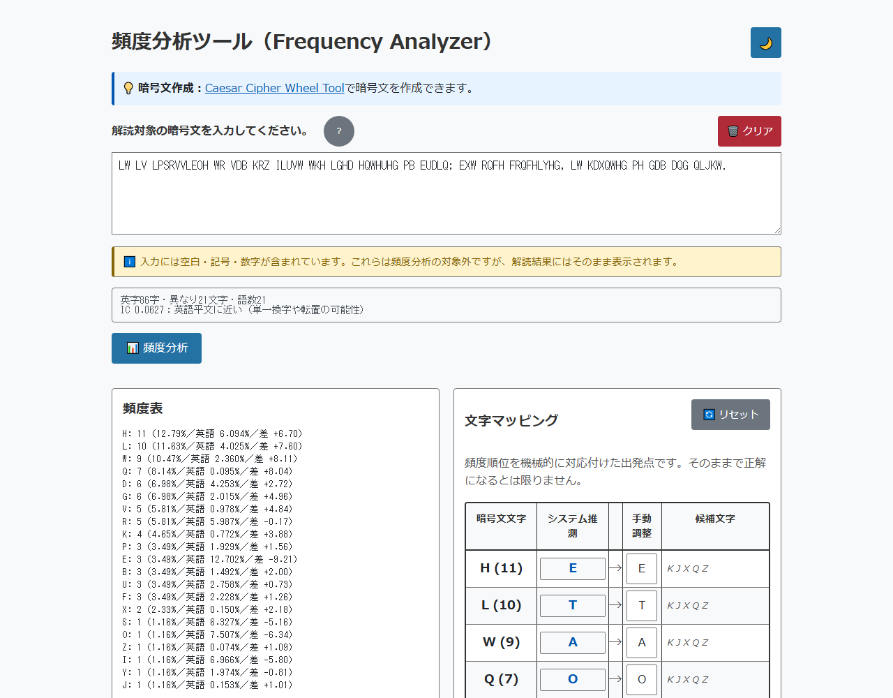
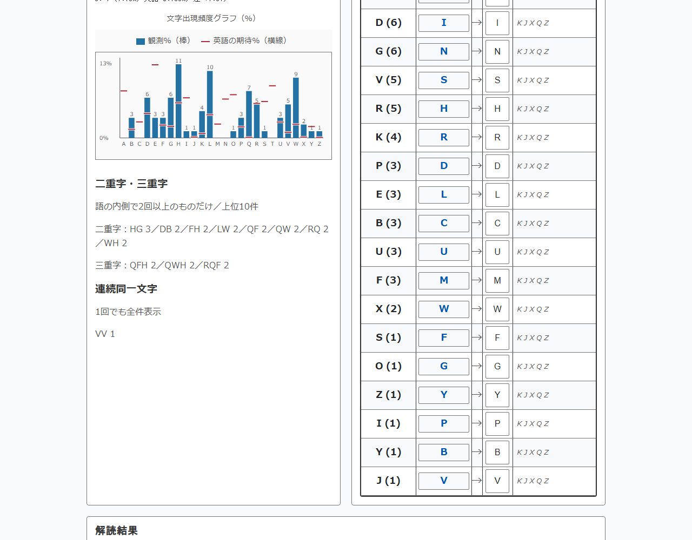
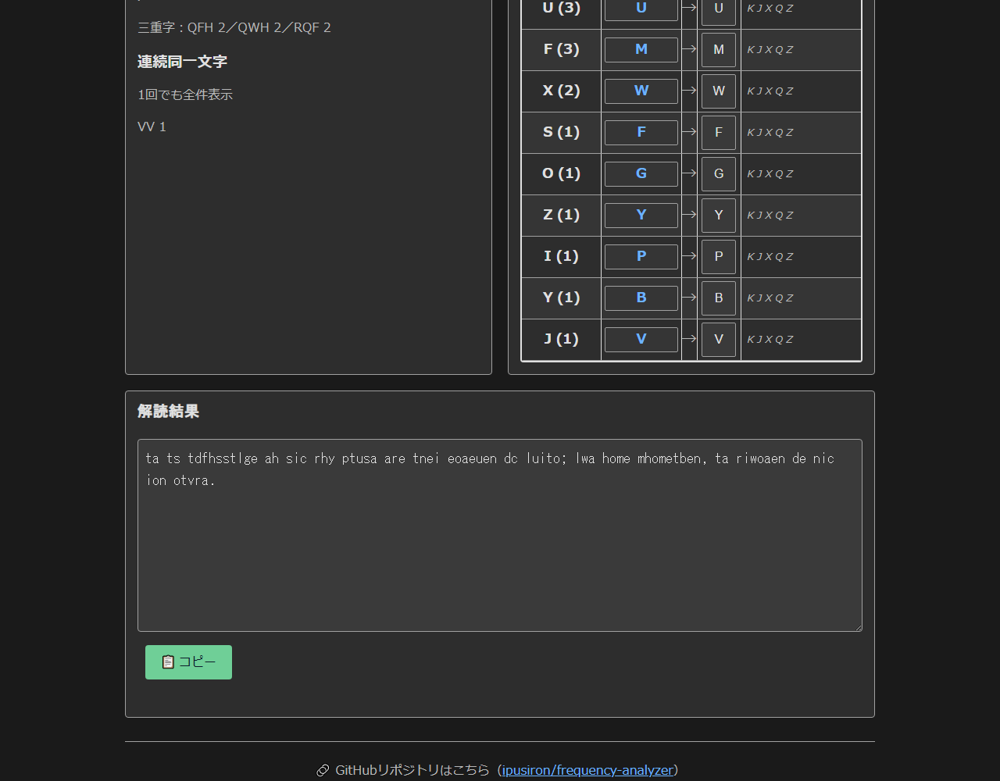
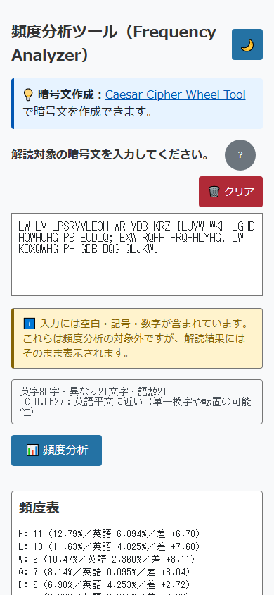

<!--
---
id: day009
slug: frequency-analyzer

title: "Frequency Analyzer"

subtitle_ja: "頻度分析ツール"
subtitle_en: "Frequency Analysis Tool for Classical Cipher Decryption"

description_ja: "英文の暗号文を英語標準頻度・一致指数・n-gramで分析し、単一換字式暗号の手動解読を支援するツール。"
description_en: "A frequency analysis and decryption tool for English-based ciphertext. Useful for breaking monoalphabetic substitution ciphers."

category_ja:
  - 暗号解析
  - 古典暗号
category_en:
  - Cryptanalysis
  - Classical Cryptography

difficulty: 3

tags:
  - frequency-analysis
  - cryptanalysis
  - monoalphabetic-substitution-ciphers

repo_url: "https://github.com/ipusiron/frequency-analyzer"
demo_url: "https://ipusiron.github.io/frequency-analyzer/"

hub: true
---
-->

# Frequency Analyzer - 頻度分析ツール


[](https://ipusiron.github.io/frequency-analyzer/)

**Day009 - 生成AIで作るセキュリティツール100**

Frequency Analyzerは、英文ベースの暗号文を対象とした頻度分析＆解読ツールです。  
英語の標準頻度、一致指数（IC）、二重字・三重字を手がかりに、単一換字式暗号の手動解読を支援します。

---

## 🌐 デモページ

👉 [https://ipusiron.github.io/frequency-analyzer/](https://ipusiron.github.io/frequency-analyzer/)

---

## 📸 スクリーンショット

以下は実際の画面例です。

<p align="center"></p>

> *初期暗号文の英字86字・IC 0.0627と頻度表*

<p align="center"></p>

> *観測％の棒・英語期待％の横線と二重字・三重字*

<p align="center"></p>

> *候補文字が表示されたマッピング表と解読結果*

<p align="center"></p>

> *幅390pxの1カラム表示*

---

## ✨ 機能

本ツールは以下の処理を行います。

- **文字ごとの出現頻度集計とグラフ表示**
- **ETAOIN順による自動マッピング推定**
- **マッピングの手動調整（競合検知あり）**
- **仮想復号結果の表示**
- **候補文字の提示（未使用文字から選出）**
- **結果のコピー・クリア機能**
- 英語標準頻度との比較、一致指数、語内の二重字・三重字と連続同一文字の集計
- 再分析時の手動マッピング保持、ライト・ダーク切替、モバイル表示

---

## 📖 使い方

1. ページを開き、初期暗号文の自動分析結果を確認する。
2. 出現頻度の一覧とグラフ、IC、n-gramを読む。
3. 自動推測を出発点として、マッピング欄で文字を手動調整する。
4. 「📊 頻度分析」を押して再分析する。手動で編集した文字の値は保持される。
5. 「📋 コピー」で解読結果をコピーする。使えない環境では結果を選択して手動コピーする。
6. 「🔄 リセット」で手動調整を解除し、自動推測に戻す。
7. 「🗑️ クリア」で暗号文・表示結果をすべて初期化する。

---

### 🔐 入力について

- 頻度分析の対象は大文字のA–Zだけである。
- 小文字は確定済みの平文文字として扱い、そのまま出力する。
- 小文字で入力した文字は、システム推測と候補から除外する。
- IC・n-gramも大文字だけを集計し、小文字はn-gramの区切りとする。
- 空白・記号・改行・日本語・絵文字も入力でき、変換せず出力する。

たとえば`ABcDE`は大文字4字・2語として扱い、二重字は`AB`と`DE`だけを数えます。
確定平文の`c`を取り除いて`BD`を数えることはありません。

#### 大文字・小文字の使い分け例

部分的に解読が進んでいる暗号文も入力できます。

```
THe QUICk BRoWN foX JUMPs oVeR THe LAZy DoG
```

この例では大文字だけを集計します。
小文字の`e, k, o, f, s, y`は確定平文としてそのまま出力し、推測候補から除外します。

---

### 🔗 URL経由での暗号文読み込み

GETパラメーターを使用して、URL経由で暗号文を自動的に読み込めます。

#### URLの指定方法

URLに`?text=`パラメーターを付けて、URLエンコードした暗号文を渡します。

```
https://ipusiron.github.io/frequency-analyzer/?text=LW%20LV%20LPSRVVLEOH
```

#### URLパラメーターの仕様

- **パラメーター名**: `text`
- **形式**: URLエンコードされた文字列
- **文字数制限**: 5,000文字まで
- **動作**: ページ読み込み時に入力欄にセットし、頻度分析を実行する。

`URLSearchParams`による1回のデコードだけを使います。
`?text=100%25`は`100%`、`?text=%2541BC`は`%41BC`として扱い、二重デコードしません。
`?text=A%2BB`は`A+B`、`?text=A+B`は`A B`になります。
5,000文字ちょうどは受け入れ、超える場合は読み込まず画面に警告を表示します。

---

## 📐 画面構成

- 統計パネル：英字数・異なり文字数・語数・ICと判定、短文の低信頼注記
- 頻度表とグラフ：観測回数・観測％・英語期待％・差、観測の棒と期待値の横線
- n-gram：語内の二重字・三重字は2回以上の上位10件、連続同一文字は1回でも全件
- マッピング表：システム推測、手動調整、頻度順の候補（最大8件と残り件数）
- 解読結果：小文字への置換、変更ハイライト、コピー通知

候補は使用済み文字・確定平文文字・その行の現在値を除きます。
初期状態の各行は`K J X Q Z`、Hの手動欄を空にすると`E K J X Q Z`です。
重複した平文文字は背景色だけでなく、一覧の文言と入力欄の`aria-invalid`でも示します。

## 🎯 ユースケース

### 🧠 解読補助としての用途

頻度分析は以下のような暗号解読に使われます。

- **シーザー暗号（Caesar Cipher）**
- **単一換字式暗号（Monoalphabetic Substitution）**
- **ヴィジュネル暗号の列分割後の分析**

---

### ヴィジュネル暗号の解読補助

#### ゲーム「Cypher」でFrequency Analyzerを利用する

- [MONOALPHABETIC SUBSTITUTION PUZZLE 01【Cypher編】](https://akademeia.info/?p=35916)
- [MONOALPHABETIC SUBSTITUTION PUZZLE 02【Cypher編】](https://akademeia.info/?p=36034)
- [MONOALPHABETIC SUBSTITUTION PUZZLE 03【Cypher編】](https://akademeia.info/?p=36107)

### スライド「古典暗号のビジュアル解読法　ー生成AIツールで挑む暗号文の謎解きー」

「ゆるいハッキング大会 第122回」で発表した「古典暗号のビジュアル解読法」では、ヴィジュネル暗号文を自作ツールを使って解読しました。
その発表に使ったスライドが理解に役立つはずです。

- [ゆるいハッキング大会で「古典暗号のビジュアル解読法」を発表してきました](https://akademeia.info/?p=43255)
- [古典暗号のビジュアル解読法　ー生成AIツールで挑む暗号文の謎解きー](https://www.docswell.com/s/ipusiron/Z37Y8D-2025-08-23-155721)

<a href="https://www.docswell.com/s/ipusiron/Z37Y8D-2025-08-23-155721">
  
</a>

---

### 『生成AIで作るセキュリティツール100』で紹介したヴィジュネル暗号文の解読

ここに記載の内容は[『生成AIで作るセキュリティツール100』](https://akademeia.info/?page_id=44531)のP.71-75の内容を抜粋したものになります。

1. まず、ターゲット暗号文（解読対象の暗号文）がどの暗号方式によるものかを特定します。その際に有効なのが、一致指数（IC）という概念です。

一致指数とは、テキスト中から任意の2文字をランダムに選んだとき、それらが同じ文字である確率を表す指標です。
古典暗号の解読において、鍵長の推定などに利用される統計量です。

- [IC Learning Visualizer](https://github.com/ipusiron/ic-learning-visualizer) - 一致指数をビジュアル理解するツール（Day047）
- [Cipher Clairvoyance](https://github.com/ipusiron/cipher-clairvoyance) - 暗号化方式推定ツール（Day044）

2. ターゲット暗号文がヴィジュネル暗号文であると推測されたら、次に鍵長（鍵文字列の文字数）を推定します。

鍵長を求める手法としては、カシスキー法が有効です。
本プロジェクトのツールの中では、以下を用いるのが最適です。

- [RepeatSeq Analyzer](https://github.com/ipusiron/repeatseq-analyzer) - 反復文字列の特定ツール（Day028）

3. 鍵長を推定したら、ターゲット暗号文を列ごとに分割します。

たとえば、推定した鍵長が5の場合、暗号文を5つの列に分けることになります。
これをLinuxコマンドで実現するには、次のように入力します。

```bash
$ cat cipher.txt | fold -w1 | awk 'NR%5==1' > col1.txt
$ cat cipher.txt | fold -w1 | awk 'NR%5==2' > col2.txt
$ cat cipher.txt | fold -w1 | awk 'NR%5==3' > col3.txt
$ cat cipher.txt | fold -w1 | awk 'NR%5==4' > col4.txt
$ cat cipher.txt | fold -w1 | awk 'NR%5==0' > col5.txt
```

以上は列分割の仕組みを理解してもらうために、あえてLinuxコマンドを例に挙げて説明しました。

しかし、本プロジェクトで開発したModular Text Dividerを使えば、ブラウザー上の操作だけで簡単に列分割を実行できます。

- [Modular Text Divider](https://github.com/ipusiron/modular-text-divider) - テキスト列分割ツール（Day030）

また、列分割後の各テキストには「頻度分析」ボタンが用意されています。
このボタンを押すと、Frequency Analyzerに自動的に遷移し、分割されたテキストが入力欄にセットされます。
そのためすぐに頻度分析の工程に移れます。

4. 列分割テキストを頻度分析します。

Frequency Analyzerは「暗号文の出現頻度」と「英文の文字頻度」（ETAOIN順）を対応付けることで、暗号文文字と平文文字の候補を自動マッピングしてくれます。

ここで目的とするのは、暗号方式の特定ではなく、鍵文字列の推定です。
つまり、平文文字'E'に対応する暗号文文字を特定できればよいのです。
文字出現頻度のグラフを観察し、1つだけ飛び抜けて出現回数が多い文字があれば、その文字が平文文字'E'に対応する可能性が高いと考えられます。
また、複数の文字が同程度に多い場合は、それらのいずれかが'E'に対応している可能性があります。

ここでは、以下の結果が得られたと仮定します。

- 1列目：「平文文字'E'」⇔「暗号文文字'I' or 'X' or 'S'」
- 2列目：「平文文字'E'」⇔「暗号文文字'E' or 'T'」
- 3列目：「平文文字'E'」⇔「暗号文文字'K'」
- 4列目：「平文文字'E'」⇔「暗号文文字'P' or 'E'」
- 5列目：「平文文字'E'」⇔「暗号文文字'X' or 'I'」

5. ヴィジュネル暗号表を用いて、平文文字と暗号文文字から鍵文字を特定します。

このステップは、機械的な計算で実行できます。
[Vigenere Cipher Tool（Day017）](https://github.com/ipusiron/vigenere-cipher-tool)の「タブラレクタ研究」タブには、「平文文字と暗号文文字から鍵文字を求める」機能が備わっています。
先に示した平文文字と暗号文文字の対応を入力すれば、鍵文字を算出できます。

以下は、各列の鍵文字候補になります。

- 1列目：E, T, O
- 2列目：A, P
- 3列目：G
- 4列目：L, A
- 5列目：T, E

6. 鍵文字候補を組み合わせて、元の鍵文字列を特定します。

鍵文字のすべての組み合わせパターンを生成すれば、その中の1つが正しい鍵文字列になります。
ただし、候補が多すぎる場合は、暗号文を作成した人物の特性（出身地、母国語、時代背景、性格など）を考慮すると効果的です。

もし鍵文字列に英単語が含まれている可能性があれば、生成パターンの中から英単語に一致するものを抽出することで、正しい鍵文字列を見つけやすくなります。
本プロジェクトでは、この処理を支援するツールも作成しました。

- [AlphaLoom](https://github.com/ipusiron/alphaloom) - 文字組み合わせ＆生成文字列分析ツール（Day046）

先の例でAlphaLoomを使うと、"EAGLE"という鍵文字列が導かれます。

7. 得られた鍵文字列が正しいかどうかは、実際に復号して確認します。

ヴィジュネル暗号の復号は、Vigenere Cipher Toolを使えば簡単に実行できます。
復号の結果、英文として自然に読めるのであれば、その鍵文字列が正しいことになります。
複数の候補が存在する場合でも、復号結果を比較すれば、英文として成立するものがただ1つに絞り込まれるはずです。

以上が、ヴィジュネル暗号文の解読に至るまでの一連の流れです。

---

## 🔬 技術的な説明

### 英語標準頻度との比較

観測％は各暗号文文字の回数を英字数で割った値です。
期待％は同じアルファベットの英語標準頻度です。暗号文文字に対応する平文文字の確率ではありません。
差は観測％から期待％を引いて表示します。
英語頻度表はRandy L. Haupt著『Wireless Communications Systems: An Introduction』の[Figure 1.6（Wiley公開抜粋、6ページ）](https://catalogimages.wiley.com/images/db/pdf/9781119419174.excerpt.pdf)に掲載された値を使っています。
文章の種類によって実際の頻度は変わります。

| 文字 | 英語標準頻度（％） |
|---|---:|
| A | 8.167 |
| B | 1.492 |
| C | 2.782 |
| D | 4.253 |
| E | 12.702 |
| F | 2.228 |
| G | 2.015 |
| H | 6.094 |
| I | 6.966 |
| J | 0.153 |
| K | 0.772 |
| L | 4.025 |
| M | 2.406 |
| N | 6.749 |
| O | 7.507 |
| P | 1.929 |
| Q | 0.095 |
| R | 5.987 |
| S | 6.327 |
| T | 9.056 |
| U | 2.758 |
| V | 0.978 |
| W | 2.360 |
| X | 0.150 |
| Y | 1.974 |
| Z | 0.074 |

### 初期暗号文の実測値

| 項目 | 値 |
|---|---:|
| 英字数 | 86 |
| 異なり文字数 | 21 |
| 総文字数 | 109 |
| 語数 | 21 |
| IC（小数4桁） | 0.0627 |
| ETAOIN推測の正解数 | 2/21 |

| 暗号文文字 | 観測回数 | 観測％ | 英語期待％ | 差 |
|---|---:|---:|---:|---:|
| H | 11 | 12.79 | 6.094 | +6.70 |
| L | 10 | 11.63 | 4.025 | +7.60 |
| W | 9 | 10.47 | 2.360 | +8.11 |
| Q | 7 | 8.14 | 0.095 | +8.04 |
| D | 6 | 6.98 | 4.253 | +2.72 |
| G | 6 | 6.98 | 2.015 | +4.96 |

復号例の暗号文は次のとおりです。

```text
LW LV LPSRVVLEOH WR VDB KRZ ILUVW WKH LGHD HQWHUHG PB EUDLQ; EXW RQFH FRQFHLYHG, LW KDXQWHG PH GDB DQG QLJKW.
```

各暗号文文字をアルファベット順で3字戻す正解マッピングを入力すると、次の平文になります。

```text
it is impossible to say how first the idea entered my brain; but once conceived, it haunted me day and night.
```

### 一致指数の目安と限界

一致指数は`IC = Σ f_c(f_c − 1) / (n(n − 1))`で計算します。
`f_c`は文字cの出現回数、nは対象英字数です。2字未満では算出できません。
英語平文の目安は0.0667、26文字の均等分布は約0.0385です。
単一換字や転置は文字の個数を保つため、ICだけでは両者を区別できません。

| ICの範囲 | 画面の判定 |
|---|---|
| 0.060以上 | 英語平文に近い（単一換字や転置の可能性） |
| 0.045以上0.060未満 | 判定保留 |
| 0.045未満 | 均等分布に近い（多表式の可能性） |

初期暗号文から空白・記号を除き、先頭から指定した英字数だけ取ると、次の値になります。

| 英字数 | IC（小数6桁） |
|---|---:|
| 10 | 0.133333 |
| 20 | 0.073684 |
| 50 | 0.059592 |
| 86 | 0.062654 |

短文では値が大きく変わるため、英字30字未満には低信頼の注記を出します。
30字は余裕を取った設計上の選択であり、証明された下限ではありません。
同じ平文を鍵`EAGLE`のヴィジュネル暗号にすると、ICは0.044049に下がります（鍵は英字の位置だけで進めます）。

### n-gramと手動調整

二重字・三重字は語の内側だけで数えます。
語をまたいだ文字列を混ぜると、単語内のつづりの手がかりと区別できなくなるためです。
初期暗号文の二重字は異なり56種・延べ65件で、2回以上は`HG 3／DB 2／FH 2／LW 2／QF 2／QW 2／RQ 2／WH 2`です。
三重字は異なり41種・延べ44件で、2回以上は`QFH 2／QWH 2／RQF 2`、連続同一文字は`VV 1`です。

ETAOINの素朴な順位対応付けは、初期暗号文の21文字中2文字（H→E、V→S）しか当たりません。
自動推測を出発点にし、n-gramやダブルレター、単語の形を使って手動調整するためのツールです。
再分析時は手動調整を保持し、入力から消えた文字だけを削除します。
手動でない文字は新しい頻度順位で更新します。

## 🔒 セキュリティ

入力テキストを外部へ送信しません。アプリは外部通信を行わず、必要なJSとCSSは同じ配信元から読み込みます。
入力やマッピングは保存せず、ライト・ダークの選択だけを`localStorage`に保存します。
URLに暗号文を含めた場合はアドレスやブラウザー履歴、配信サーバーのアクセスログに残る可能性があります。

CSPをmetaで設定し、外部スクリプト、インラインスクリプト・スタイル、オブジェクト、フォーム送信などを制限しています。
表示にはDOM構築と`textContent`を使い、referrerは`no-referrer`にしています。
GitHub Pagesの標準配信では任意のレスポンスヘッダーを設定できず、`frame-ancestors`はmetaでは使えないため指定していません。
そのため、この構成には`frame-ancestors`によるクリックジャッキング対策はありません（[CSP仕様](https://www.w3.org/TR/CSP3/#directive-frame-ancestors)）。

## ⚠️ 注意

- ICや頻度の順位だけでは暗号方式や正解を決められない。
- 小文字は確定平文であり、暗号文の集計に混ぜない。
- 機密情報をURLパラメーターに入れない。
- 自分が解析する権限を持つ暗号文や、学習用の素材に使用する。

## 🧪 テスト

Node 22以上で`npm test`を実行します。`node --test`を使い、npm依存はありません。
GitHub Actionsでpushとpull_requestのたびに自動実行します。
頻度・IC・n-gram・候補・手動値の保持・復号・URL処理・HTML・コントラスト・整形を検証します。
READMEの表の数値、復号例、画像参照も実コードから再計算して確認しています。

## ❓ FAQ

### 自動推測が正解にならない場合

ETAOINは出現順位を対応付けるだけです。短文や文章の内容によって順位が変わります。
候補とn-gramを見ながら手動調整してください。

### 再分析とリセットの違い

再分析は手動で編集した文字を保持します。リセットは手動編集の記録を消し、システム推測へ戻します。
クリアは入力と結果をすべて消します。

## 🔗 参考

### 関連ツール

- **[Substitution Mapping Mixer](https://github.com/ipusiron/substitution-mapping-mixer) – 換字式暗号の手動解析ワークベンチ**（Day105）
  - 置換表を試行錯誤で調整するときに役立つ。

---

## 📁 ディレクトリー構造

```text
frequency-analyzer/
├── index.html          # 入力・統計・グラフ・マッピング画面
├── freq-logic.js       # DOMに触れない解析・復号ロジック
├── main.js             # DOMの更新とイベント処理
├── style.css           # レスポンシブ表示と両テーマの配色
├── assets/             # スクリーンショット4枚と既存スライド画像
├── test/               # node:testによる6つのテストファイル
├── .github/workflows/test.yml # push・PR時の自動テスト
├── package.json        # npm test（依存なし）
├── CLAUDE.md           # 開発ガイド
├── LICENSE             # MITライセンス
└── README.md           # 使い方と検証可能な例
```

## 💻 動作環境

Chrome・Edge・Firefox・Safariなどのモダンブラウザーを対象としています。
`index.html`をfile://で直接開いても全機能が動きます。ネットワークで外部ファイルを取得しないためです。
クリップボードAPIが使えない環境では手動コピーを案内します。
HTTPで確認する場合は`python -m http.server 8000`などで配信できます。
Node 22以上が必要なのはテスト実行時だけです。

## 📄 ライセンス

このプロジェクトは[MITライセンス](./LICENSE)の下で公開されています。

---

## 🛠 このツールについて

本ツールは、「生成AIで作るセキュリティツール100」プロジェクトの一環として開発されました。 このプロジェクトでは、AIの支援を活用しながら、セキュリティに関連するさまざまなツールを100日間にわたり制作・公開していく取り組みを行っています。

プロジェクトの詳細や他のツールについては、以下のページをご覧ください。

🔗 [https://akademeia.info/?page_id=42163](https://akademeia.info/?page_id=42163)
