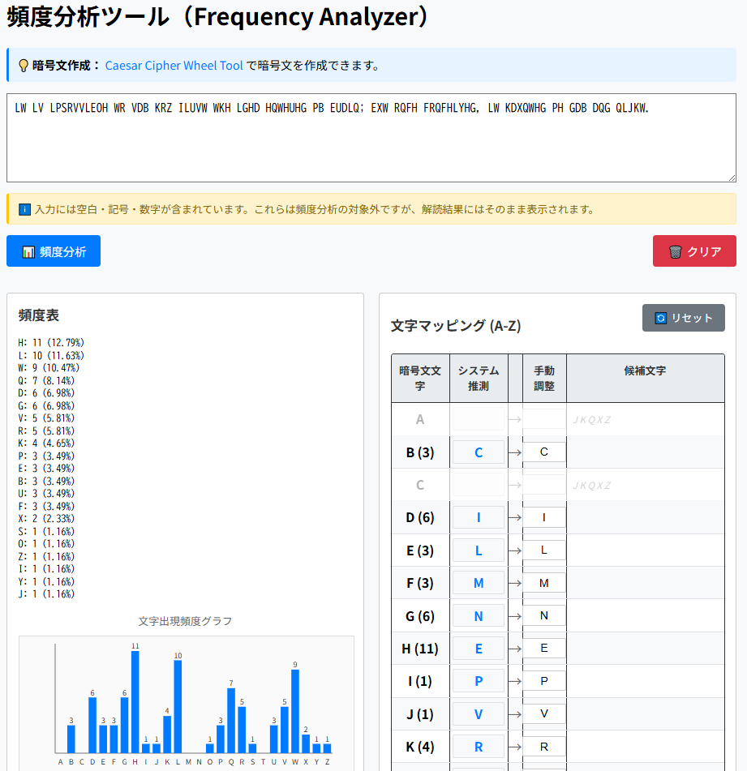

# 頻度分析ツール（Frequency Analyzer）

**Day 9 - 生成AIで作るセキュリティツール100**

これは英文ベースの暗号文を対象とした頻度分析＆解読ツールです。  
シーザー暗号や単一換字式暗号の解読に役立ちます。

---

## 🌐 デモページ

👉 [https://ipusiron.github.io/frequency-analyzer/](https://ipusiron.github.io/frequency-analyzer/)

---

## 📸 スクリーンショット

以下は実際の画面例です。

>
>
> *初期画面*

---

## 🔍 概要

本ツールは以下の処理を自動で行います：

- **文字ごとの出現頻度集計とグラフ表示**
- **ETAOIN順による自動マッピング推定**
- **マッピングの手動調整（競合検知あり）**
- **仮想復号結果の表示**
- **候補文字の提示（未使用文字から選出）**
- **結果のコピー・クリア機能**

---

## ✏️ 使い方

1. ページを開くと、デフォルトの暗号文が入力された状態で自動的に頻度分析が行われます。
2. 出現頻度が一覧とグラフで表示されます。
3. 推定されたマッピングが初期設定されており、そのままでも仮想復号が表示されます。
4. 必要に応じてマッピング欄で手動修正も可能です（重複検出機能あり）。
5. 「📋 コピー」で解読結果をコピーできます。
6. 「マッピングクリア」で自動推定にリセットされます。
7. 「🗑️ クリア」で暗号文・表示結果をすべて初期化します。

---

## 🔐 入力について

- 入力できる文字は英語（A–Z）で、**空白・記号・改行も含んでOK**です。
- それ以外の文字は無視されます。

---

## 🔗 URL経由での暗号文読み込み

GETパラメーターを使用して、URL経由で暗号文を自動的に読み込めます。

### 使い方

URLに`?text=`パラメーターを付けて、URLエンコードした暗号文を渡します。

```
https://ipusiron.github.io/frequency-analyzer/?text=LW%20LV%20LPSRVVLEOH
```

### 仕様

- **パラメーター名**: `text`
- **形式**: URLエンコードされた文字列
- **文字数制限**: 5,000文字まで
- **動作**: ページ読み込み時に自動的に入力欄にセットされ、頻度分析が実行されます

---

## 🧠 解読補助としての用途

頻度分析は以下のような暗号解読に使われます：

- **シーザー暗号（Caesar Cipher）**
- **単一換字式暗号（Monoalphabetic Substitution）**
- **ヴィジュネル暗号の列分割後の分析**

### 🧪 ヴィジュネル暗号の解読補助として使うには？

1. 暗号文から鍵長を推定します。
例えば、カシスキー法などが有効な方法です。

2. 鍵長が `5` のとき、以下のように `5` 分割します。以下はLinuxのコマンド例です。

```bash
cat cipher.txt | fold -w1 | awk 'NR%5==1' > col1.txt
cat cipher.txt | fold -w1 | awk 'NR%5==2' > col2.txt
cat cipher.txt | fold -w1 | awk 'NR%5==3' > col3.txt
cat cipher.txt | fold -w1 | awk 'NR%5==4' > col4.txt
cat cipher.txt | fold -w1 | awk 'NR%5==5' > col5.txt
```

---

## 📄 ライセンス

MIT License - 詳細は[LICENSE](LICENSE)をご覧ください。

---

## 🔥 このツールについて

本ツールは、「生成AIで作るセキュリティツール100」プロジェクトの一環として開発されました。 このプロジェクトでは、AIの支援を活用しながら、セキュリティに関連するさまざまなツールを100日間にわたり制作・公開していく取り組みを行っています。

プロジェクトの詳細や他のツールについては、以下のページをご覧ください。

🔗 [https://akademeia.info/?page_id=42163](https://akademeia.info/?page_id=42163)
